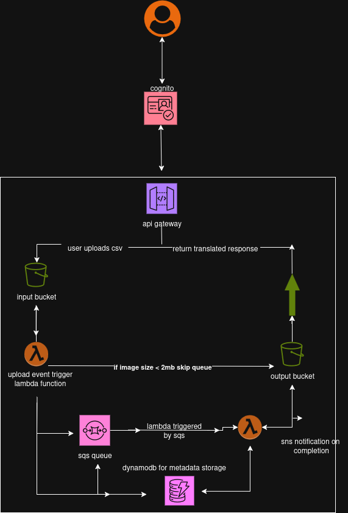

## Table of Contents
1. [Overview](#overview)
2. [Architecture](#architecture)
3. [Easy Start](#easy-start)
4. [Getting Started](#getting-started)
5. [API Reference](#api-reference)
6. [Authentication](#authentication)
7. [Troubleshooting](#troubleshooting)
8. [Deployment](#deployment)
9. [Monitoring](#monitoring)
10. [Limitations](#limitations)
11. [FAQ](#faq)

## Overview

This application provides a serverless solution for translating CSV files from English to Spanish. It features secure user authentication, file upload processing, and asynchronous translation capabilities with api keys.

## Architecture

### Event-Driven Serverless Components

```
1. Client → API Gateway → Cognito (Authentication)
2. Authenticated Request → Lambda (Upload Handler) → S3 (Input Bucket)
3. S3 Event → SQS Queue → Translation Processor Lambda
4. Translation Processor → DynamoDB (Metadata) → S3 (Output Bucket)
5. API Gateway Endpoints for file retrieval and API key management
```

### Core Components
- **AWS Lambda Functions**:
  - `translation_upload_handler`: Handles file uploads
  - `translation_processor`: Processes translation jobs
  - `translation_get_user_uploads`: Retrieves user's files
  - `translation_get_all_files`: All file access
  - `translation_api_keys`: Manages translation API keys

- **AWS Services**:
  - Cognito: User authentication/authorization
  - S3: File storage (input/output buckets)
  - SQS: Queue for translation jobs
  - DynamoDB: Metadata storage
  - API Gateway: REST API interface
  - IAM: Security permissions


## Easy Start

### One-Command Deployment

Get your translation app up and running with a single command using our automated deployment script:

# Clone the repo
```
git clone https://github.com/guderian120/translation_service_infra
cd translation_service_infra/scripts
```
```bash
sudo chmod +x deploy.sh
./deploy.sh
```

This script handles:
1. Infrastructure provisioning with Terraform
2. Configuration generation
3. Docker container deployment

### What the Script Does:

1. **Prerequisites Check**:
   - Verifies Terraform, Docker, and jq are installed
   - Ensures AWS credentials are configured

2. **Infrastructure Setup**:
   - Initializes Terraform
   - Provisions all AWS resources (Cognito, API Gateway, S3 buckets, etc.)

3. **Configuration Generation**:
   - Automatically extracts Terraform outputs
   - Creates environment variables file
   - Generates Cognito configuration template

4. **Container Deployment**:
   - Launches the Frontend Docker container with proper configuration
   - Maps container port 80 to host port 8080
   - Handles cleanup of previous deployments

### Post-Deployment Actions

After successful deployment:
- Access the app at: [http://localhost:8080](http://localhost:8080)
- Signup with valid emails and credentials
- Voila your app is up and running
- View logs: `docker logs -f translation-app`
- Stop the app: `docker stop translation-app`

### Windows Users

For Windows systems, I recommend:
1. Using WSL (Windows Subsystem for Linux)
2. Running the script unchanged in a WSL terminal

Alternatively, use the PowerShell version available in `/scripts/windows-deploy.ps1`

### Configuration Management

All sensitive configuration is handled through:
- Environment variables (stored in `cognito.env`)
- Automatic template processing at runtime
- Secure Docker container deployment


# Manual Approach
## Getting Started

### Prerequisites
- AWS account with appropriate permissions
- Terraform installed (v1.0+)
- Python 3.8+ for Lambda functions
- AWS CLI configured

### Installation
1. Clone the repository
2. Initialize Terraform:
   ```bash
   terraform init
   ```
3. Deploy:
   ```bash
   terraform apply
   ```

### First-Time Setup
1. Create a Cognito user:
   ```bash
   aws cognito-idp sign-up --client-id [YOUR_CLIENT_ID] --username [EMAIL] --password [PASSWORD]
   ```
2. Confirm the user:
   ```bash
   aws cognito-idp admin-confirm-sign-up --user-pool-id [POOL_ID] --username [EMAIL]
   ```

## API Reference

### Authentication
All endpoints require a valid Cognito JWT in the Authorization header:
```
Authorization: Bearer [JWT_TOKEN]
```

### Endpoints

#### 1. File Upload
- **POST** `/upload`
- Content-Type: `multipart/form-data`
- Body: CSV file
- Response: 
  ```json
  {
    "fileId": "uuid",
    "status": "queued",
    "timestamp": "ISO-8601"
  }
  ```

#### 2. Get User Files
- **GET** `/files`
- Response:
  ```json
  [{
    "fileId": "uuid",
    "originalName": "file.csv",
    "translatedName": "file_es.csv",
    "status": "completed|processing|failed",
    "uploadDate": "ISO-8601",
    "completionDate": "ISO-8601"
  }]
  ```


#### 3. API Key Management
- **GET** `/api-keys`
- Response:
  ```json
  {
    "remainingQuota": 1000,
    "lastReset": "ISO-8601"
  }
  ```

## Authentication

### Cognito Integration
- User pool provides JWT tokens
- API Gateway validates tokens for each request
- IAM policies enforce least-privilege access

### Token Flow
1. User authenticates with Cognito
2. Receives JWT (ID token + access token)
3. Includes token in API requests
4. API Gateway authorizes request

## Troubleshooting

### Common Issues

#### 1. Upload Fails with 403
- **Cause**: Missing/invalid Cognito token
- **Solution**:
  - Verify token is included in `Authorization` header
  - Check token expiration with [jwt.io]
  - Re-authenticate if expired

#### 2. Files Not Processing
- **Check SQS Queue**:
  ```bash
  aws sqs get-queue-attributes --queue-url [QUEUE_URL] --attribute-names ApproximateNumberOfMessages
  ```
- **Verify Lambda Subscriptions**:
  ```bash
  aws lambda list-event-source-mappings --function-name [FUNCTION_NAME]
  ```

#### 3. Translation Errors
- **Check CloudWatch Logs**:
  ```bash
  aws logs filter-log-events --log-group-name "/aws/lambda/[FUNCTION_NAME]" --start-time [TIMESTAMP]
  ```
- **Verify API Keys** in DynamoDB:
  ```bash
  aws dynamodb scan --table-name [API_KEY_TABLE]
  ```

#### 4. Terraform Deployment Failures
- **Common Causes**:
  - IAM propagation delays
  - Resource naming conflicts
- **Solutions**:
  - Run `terraform apply` again after 1-2 minutes
  - Check for existing resources with same names

## Deployment

### Infrastructure Management
- All infrastructure defined in Terraform
- Modular structure for maintainability
- Variables control environment-specific settings

### Updating Lambda Functions
1. Update Python code in `lambda_functions/`
2. Rebuild ZIP packages
3. Update paths in `modules/lambda/main.tf`
4. Run `terraform apply`

### Scaling Considerations
- SQS queue provides buffering for spikes
- Lambda concurrency limits may need adjustment
- Monitor DynamoDB capacity units

## Monitoring

### Recommended Metrics
1. **SQS**:
   - Number of messages visible
   - Age of oldest message
2. **Lambda**:
   - Invocation count
   - Error rates
   - Duration
3. **S3**:
   - Number of objects
   - Storage size

### CloudWatch Alarms
- Set up for:
  - Failed Lambda invocations
  - SQS queue backlog
  - 4xx/5xx API errors

## Limitations
- Maximum CSV size: 10MB (SQS payload limit)
- Supported encodings: UTF-8
- Rate limits: 1000 translations/hour (adjustable)

## FAQ

### Q: How do I reset the translation quota?
A: Update the DynamoDB record in the api_keys table with new quota values.

### Q: Can I use other translation services?
A: Yes, modify the `translation_processor` Lambda to integrate with other APIs.

### Q: How do I handle special characters?
A: The system handles UTF-8 encoded CSVs. Ensure files are properly encoded before upload.

### Q: Is there a web interface?
A: Currently only API-based, but you can build a frontend that uses these endpoints.

### Q: How do I migrate to production?
A: 1. Create separate environment variables 2. Adjust scaling parameters 3. Implement backup strategies for DynamoDB
